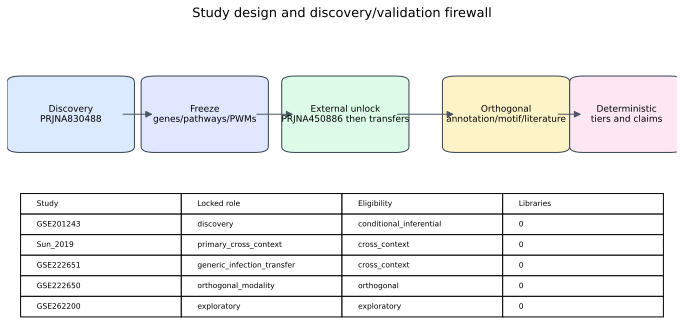
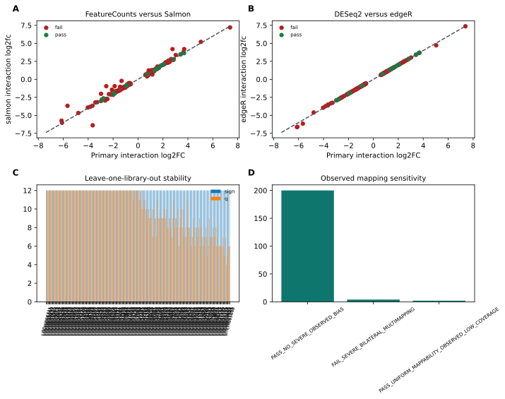
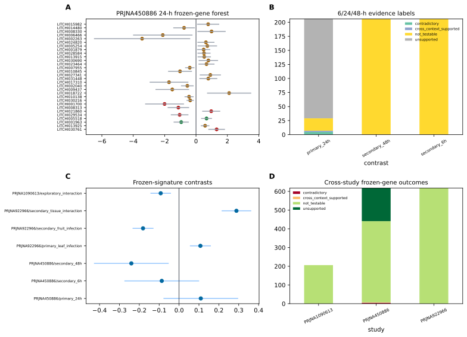
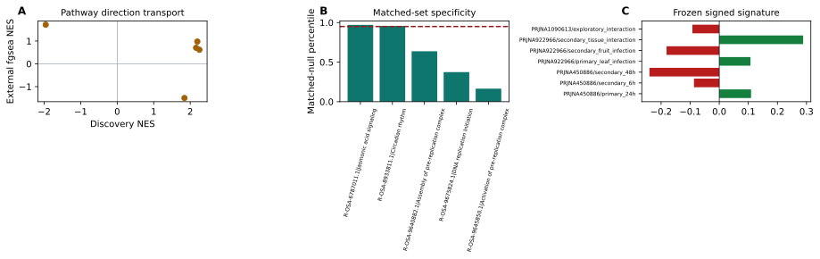
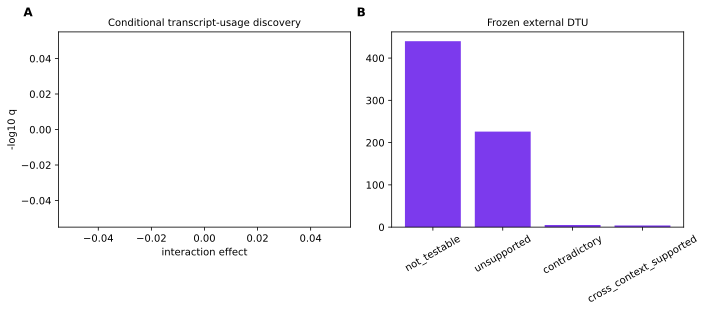
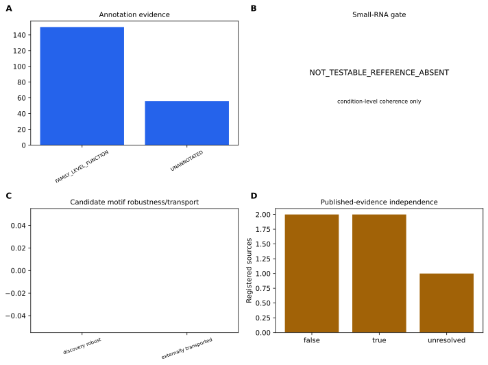
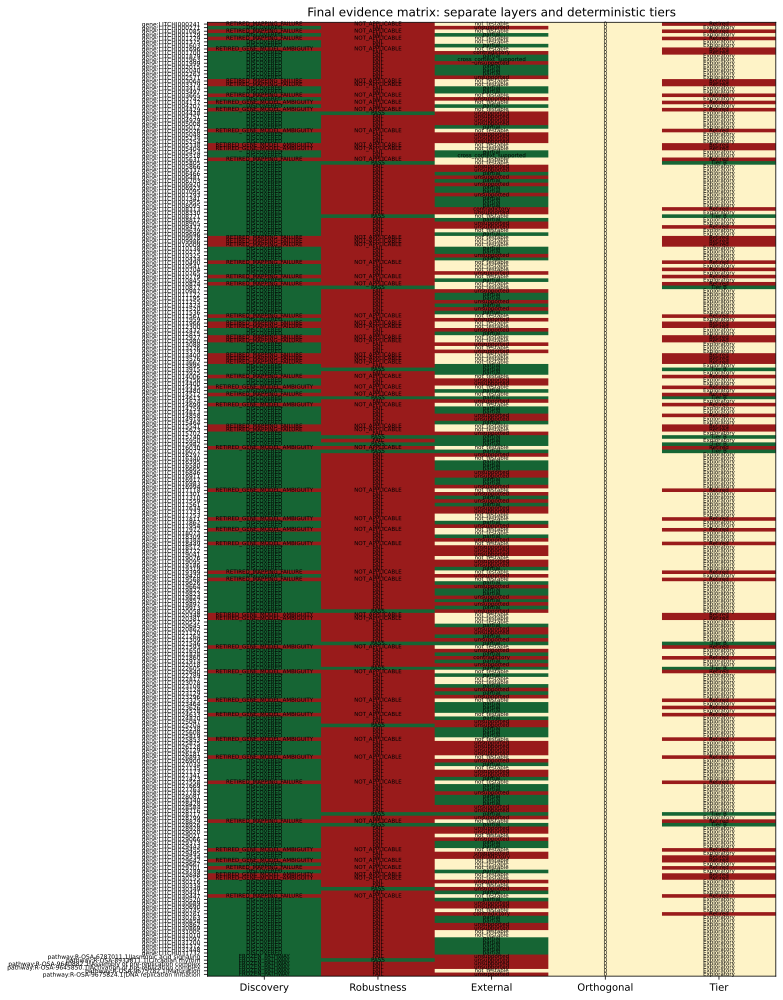

# Genome-wide interaction reanalysis reveals context-specific lychee responses to Peronophythora litchii

## Abstract

### Background

Public lychee RNA-seq cohorts contain resistant/susceptible, tissue, time, and infection contrasts, but prior selected-gene analyses did not provide a genome-wide cultivar-by-infection discovery coupled to a prospective external-evidence firewall.

### Methods

We locked PRJNA830488 as discovery and fitted a genome-wide negative-binomial model with cultivar, infection, and cultivar-by-infection terms. Candidates required genome-wide Benjamini-Hochberg q<0.05, absolute interaction log2 fold change at least log2(1.5), and uniform mapping/model quality. We froze genes, signed weights, pathways, and conditional transcript-usage results before opening external outcomes. Internal robustness covered independent quantification, edgeR, expression-filter sensitivity, leave-one-library-out analyses, and observed mapping sensitivity. Frozen evaluation used PRJNA450886 as the primary cross-context study; PRJNA922966 and PRJNA1090613 retained transfer or exploratory roles. Annotation, promoter motifs, small-RNA eligibility, and accession-aware literature were maintained as separate orthogonal classes.

### Results

<!-- evidence: discovery, robustness, external, orthogonal -->
All 12 discovery libraries passed the technical inclusion gates. Among 19445 expressed genes, 262 met the genome-wide interaction threshold and 206 remained after uniform mapping/model QC. 16 frozen genes and 1 frozen pathways passed all internal robustness gates. In the locked 24-h PRJNA450886 evaluation, 2 genes and 0 pathways were cross-context supported, while 5 genes were contradictory. The frozen signature result was estimate 0.109, 95% CI -0.079 to 0.297, q=0.349. Deterministic integration produced 0 Tier A genes, 12 Tier B genes, and 0 Tier C pathways; 65 entities were retired.

### Conclusions

<!-- evidence: interpretation -->
The evidence layers identify the exact scope of computational discoveries that are internally stable and, where observed, transport across a different tissue and resistant comparator. Cross-context support is not direct replication, and neither sequence annotation nor motif evidence establishes causality.

## Introduction

Lychee (Litchi chinensis) production is constrained by downy blight caused by the oomycete Peronophythora litchii. Public transcriptomic studies have profiled infection responses across cultivars, tissues, and time points, creating an opportunity to distinguish genome-wide cultivar-dependent responses from broad infection effects.

The principal discovery series, GSE201243/PRJNA830488, contains Guiwei and Yurong1 leaf libraries under mock and infected conditions at 24 h. Earlier interpretation of this accession emphasized selected genes and promoter elements. Such selected-feature analyses cannot control a genome-wide multiplicity family and risk using the same cohort for both selection and apparent confirmation.

We therefore implemented a discovery/validation firewall. Dataset roles, models, thresholds, empty-set behavior, and evidence vocabulary were frozen prospectively. Discovery refers only to the locked genome-wide interaction in PRJNA830488; robustness refers only to sensitivity within that study; external evidence is cross-context unless the biological estimand is directly replicated; and orthogonal evidence remains separate from expression support.

## Related Work

Sun et al. analyzed Guiwei and Heiye pericarp at 6, 24, and 48 h (PRJNA450886; doi:10.1038/s41598-019-39100-w) and reported distinct early response programs. Because that accession is the present primary external cohort, its paper is prior interpretation rather than independent validation. The GSE222650/651 Feizixiao small-RNA and mRNA studies provide condition-matched tissue contrasts but no shared BioSample accessions, so they cannot support specimen-level pairing. Molecular studies of the PlAvh202 effector (doi:10.1093/plphys/kiad311) and a pathogen transcriptome (doi:10.1371/journal.pone.0178245) provide biological context without automatically supporting a specific frozen host gene.

## Materials and Methods

### Study design and evidence definitions

The protocol and amendments are in analysis/preregistration. PRJNA830488 was the only discovery cohort. PRJNA450886 was primary cross-context evaluation, PRJNA922966 tested generic tissue/infection transfer, PRJNA922965 was orthogonal small RNA, and PRJNA1090613 remained exploratory because time and resistance metadata were unresolved. No external result could alter frozen membership or weights.

### Dataset provenance and eligibility

NCBI and GEO metadata were reconciled into a biological-unit registry. Inferential q values are conditional on deposited-library independence because source-tree, pooling, harvest, and extraction independence were not reported for the discovery libraries. The primary model required at least three included libraries in every cultivar-treatment cell.

### References and preprocessing

Host and pathogen references were combined with prefixed contig names. Paired reads were checked with FastQC, trimmed with fastp, aligned by STAR two-pass mapping, counted with featureCounts, and quantified independently with Salmon. Technical exclusion required fewer than 10 million surviving pairs or less than 40% unique alignment. GenMap-based exon uniqueness and observed candidate-level mapping checks were fixed before discovery.

### Discovery interaction model

DESeq2 fitted counts with formula ~ cultivar + treatment + cultivar:treatment, using Guiwei and mock as reference levels. The primary coefficient was cultivarYurong1.treatmentinfected: positive values indicate a stronger infected-minus-mock response in Yurong1 than Guiwei. Genes required count >=10 in at least three libraries, genome-wide BH q<0.05, and |log2FC|>=log2(1.5). apeglm-shrunken interaction effects defined signed signature weights.

### Pathways and transcript usage

Plant Reactome memberships were transported from one-to-one reciprocal-best Oryza protein matches. Pathway discovery used the frozen mapping and genome-wide interaction statistic. Transcript usage used Salmon abundances and a conditional inferential gate; no post hoc substitute was permitted if the gate failed.

### Internal robustness

Frozen genes were required to retain direction under Salmon gene aggregation, edgeR quasi-likelihood testing, a CPM filter, and leave-one-library-out fits. Predeclared correlation, effect-difference, q-value, leave-one-out, uniform mapping, and observed mapping-sensitivity gates were combined conjunctively, without an additive score. Frozen pathways required camera, roast, leading-edge deletion, and expression/length-matched null gates.

### External frozen evaluation

PRJNA450886 used ~ cultivar*treatment*time. The primary estimand was resistant-minus-susceptible cultivar-by-infection at 24 h; 6 and 48 h were secondary. Frozen candidate tests used BH adjustment across candidate-by-contrast families, an absolute log2FC threshold of log2(1.5), confidence intervals excluding zero, and discovery-direction agreement. PRJNA922966 used ~ tissue + treatment + tissue:treatment. PRJNA1090613 could not promote a final tier.

### Annotation and orthogonal evidence

Representative proteins were selected by longest CDS with lexicographic transcript tie-breaking. Reviewed Swiss-Prot release 2026_02 DIAMOND matches, targeted InterPro/Pfam matches, and one-to-one Oryza orthology were separate classes. High-confidence computational annotation required at least two classes, >=70% supported sequence coverage, and no detected architecture conflict.

The official PmiREN bulk archive was audited before small-RNA analysis. Its frozen gate was NOT_TESTABLE_REFERENCE_ABSENT; no study-derived novel-miRNA reference was substituted. Motif discovery used JASPAR 2026 Plants, strand-aware 1-kb and 2-kb promoters, 100 expression/GC-matched backgrounds, AME as primary, FIMO as sensitivity, and cognate-TF expression. Only discovery-frozen robust PWMs were transported to an independently selected PRJNA450886 response set.

### Deterministic tiers and multiplicity

Tier A required gene discovery, complete internal robustness, primary cross-context support, no mapping/annotation failure, and at least one attributable orthogonal class. Tier B required discovery and robustness with partial or non-testable external evidence. Tier C was reserved for a robust, externally supported frozen pathway without a qualifying Tier A member. Contradictory direction or mapping/annotation failure retired an entity. Zero Tier A candidates was allowed.

### Reproducibility

Snakemake workflows enforce staged discovery, external unlock, one STAR sorting job at a time, verified cleanup, and SHA-256 manifests. The resolved environment, synthetic fixtures, resource releases, all plotted source data, and protocol amendments accompany the results.

## Results

### Provenance and discovery-data quality

<!-- evidence: discovery -->
All 12 PRJNA830488 libraries passed the fixed technical gate. The combined-reference alignment, per-library QC, PCA, sample distances, and uniform gene mappability are shown in Figure 2 and Supplementary S2.

### Genome-wide cultivar-by-infection discovery

<!-- evidence: discovery -->
Of 19445 expressed genes, 262 passed the statistical interaction threshold before uniform mapping/model QC and 206 were frozen as discoveries. 6 pathways were frozen at the primary pathway threshold. Positive interaction effects indicate stronger infection response in Yurong1; negative effects indicate stronger response in Guiwei.

### Internal robustness

<!-- evidence: robustness -->
16 of 206 frozen genes passed every quantification, statistical-method, filter, leave-one-out, and mapping gate. 1 of 6 frozen pathways passed the four conjunctive pathway robustness gates.

### Primary external cross-context evaluation

<!-- evidence: external -->
At the locked PRJNA450886 24-h contrast, 2 frozen genes were cross-context supported, 5 were contradictory, and the remainder were unsupported or not testable under the fixed threshold. The frozen signed-signature result was estimate 0.109, 95% CI -0.079 to 0.297, q=0.349. No result is labeled direct replication because tissue and resistant comparator differ.

### Frozen pathways and signature

<!-- evidence: external -->
0 frozen pathways passed camera, roast, fgsea, leading-edge deletion, and matched-null external gates in PRJNA450886. Transfer-study and exploratory outcomes are retained in Table 4 and Supplementary S5-S6 without changing frozen definitions.

### Conditional transcript usage

<!-- evidence: discovery/external -->
225 frozen transcript-usage results passed the conditional gate. 

### Orthogonal evidence

<!-- evidence: orthogonal -->
0 frozen genes met the high-confidence computational annotation rule. 0 discovery motifs met the 100-background, two-window, and TF-expression gate; 0 of these transported under the external frozen test. Small-RNA coherence remained NOT_TESTABLE_REFERENCE_ABSENT. Literature entries reusing a current accession were retained as prior interpretation, not independent support.

### Final deterministic tiers and contradictory results

<!-- evidence: integrated interpretation -->
The frozen matrix assigned Tier A to none, Tier B to LITCHI005805, LITCHI008721, LITCHI010877, LITCHI013915, LITCHI014613, LITCHI015740, LITCHI015982, LITCHI016077, LITCHI021546, LITCHI022605, LITCHI028717, LITCHI028926, and Tier C to none. 65 entities were retired, including LITCHI000241, LITCHI001085, LITCHI001279, LITCHI001696, LITCHI001700, LITCHI003064, LITCHI003379, LITCHI003665, LITCHI004137, LITCHI004429, LITCHI005026, LITCHI005338, LITCHI005404, LITCHI005631, LITCHI008313, LITCHI009437, LITCHI009978, LITCHI009986, LITCHI010009, LITCHI010490, LITCHI010704, LITCHI010779, LITCHI010874, LITCHI011561, LITCHI011966, LITCHI012300, LITCHI012927, LITCHI012980, LITCHI013400, LITCHI013576, LITCHI013662, LITCHI014006, LITCHI014435, LITCHI014512, LITCHI014699, LITCHI014858, LITCHI015541, LITCHI015623, LITCHI016030, LITCHI017118, LITCHI017811, LITCHI017972, LITCHI018449, LITCHI019399, LITCHI019568, LITCHI020348, LITCHI020381, LITCHI021593, LITCHI021860, LITCHI022640, LITCHI023325, LITCHI023626, LITCHI024633, LITCHI025853, LITCHI026893, LITCHI027558, LITCHI028829, LITCHI029455, LITCHI029534, LITCHI029642, LITCHI029701, LITCHI029848, LITCHI030155, LITCHI030447, LITCHI030761. Contradictory and failed results remain visible in results/candidates/contradictory_results.tsv.

## Discussion

The analysis replaces selected-gene reuse with a genome-wide interaction discovery whose membership was fixed before external outcome access. This separation matters: a result can be statistically discovered but internally unstable, internally robust but externally not testable, or externally supported without being a direct replication.

PRJNA450886 changes tissue, resistant comparator, and time structure. Directionally concordant threshold-passing results therefore demonstrate transport across context, not repetition of the original biological experiment. PRJNA922966 addresses generic tissue/infection transfer and cannot test the cultivar interaction. PRJNA1090613 remains exploratory because unresolved metadata prevent a standardized confirmatory interpretation.

Pathway and signed-signature results can be more transportable than individual genes, but they remain dependent on the frozen Oryza-to-lychee mapping and pathway universe. Leading-edge deletion and matched-null analyses reduce, but do not eliminate, concerns about single-gene dominance or generic expression/length effects.

Annotation, motif enrichment, and literature contribute different kinds of evidence. Sequence/domain agreement supports a computational function label but not biological action in infected lychee. A transported promoter PWM is a candidate regulatory pattern, not proof of binding. The absent frozen PmiREN litchi reference made known-miRNA coherence non-testable; substituting study-derived novel sequences after viewing the gate would have violated the protocol.

Limitations include small deposited-library cell sizes, unknown source-unit independence, possible reference bias despite uniform and observed mapping checks, and lack of a direct biological replication cohort. External tissues and cultivar contrasts are deliberately heterogeneous. The deterministic framework makes these limitations visible and permits zero headline candidates rather than forcing a ranked list.

## Conclusion

This study provides a genome-wide, prospectively frozen cultivar-by-infection reanalysis of public lychee RNA-seq data, separates internal stability from cross-context evidence, and releases the resulting candidate/signature resource with null and contradictory outcomes. The final claims are computational and context-bounded; experimental perturbation and genuinely independent biological replication remain necessary for causal inference.

## Data and Code Availability

Primary public accessions are PRJNA830488/GSE201243, PRJNA450886, PRJNA922965/GSE222650, PRJNA922966/GSE222651, and PRJNA1090613/GSE262200. Exact reference releases and SHA-256 checksums are in analysis/config/resource_registry.tsv and data/reference manifests. The resolved environment is analysis/envs/lychee-discovery-resolved.yml. Protocol, amendments, result manifests, source data, and workflows are included in this repository. A repository release URL and archival DOI require the repository owner to publish the generated release and are explicitly marked pending in the submission-gate report.

## Supplementary Information

Supplementary S1-S13 contain the biological-unit registry, per-library QC, all discovery statistics, robustness manifests, all external frozen tests, pathway/signature tests, DTU, annotation/orthology, small-RNA gates, motif/background tests, the evidence registry, scripts/environments/commands, and amendments. Every main figure has a TSV source-data file.

## References

1. Sun et al. Early responses given distinct tactics to infection of Peronophythora litchii in susceptible and resistant litchi cultivar. Scientific Reports. 2019. doi:10.1038/s41598-019-39100-w.
2. Wang et al. Peronophythora litchii RXLR effector PlAvh202 destabilizes a host ethylene biosynthesis enzyme. Plant Physiology. 2023. doi:10.1093/plphys/kiad311.
3. Ye et al. Transcriptome analysis of Phytophthora litchii reveals pathogenicity arsenals and confirms taxonomic status. PLOS ONE. 2017. doi:10.1371/journal.pone.0178245.
4. MEME Suite documentation. https://meme-suite.org/
5. JASPAR. https://jaspar.elixir.no/
6. InterPro. https://www.ebi.ac.uk/interpro/
